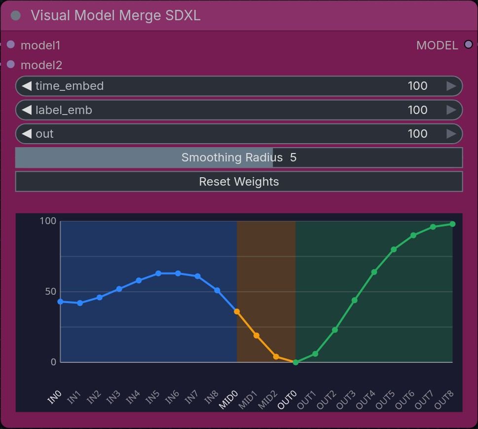

<h1 style="display:flex; align-items:center; gap:12px;">
  
  <span>Visual Model Merge SDXL</span>
</h1>

A ComfyUI custom node that provides an interactive curve editor for SDXL model block weight merging.



## Features

- Visual curve editor for controlling merge weights across 21 SDXL blocks (9 input, 3 middle, 9 output)
- Gaussian smoothing for natural curve adjustments
- Color-coded sections: Blue (IN), Orange (MID), Green (OUT)
- Additional controls for `time_embed`, `label_emb`, and `out` layer weights

## Installation

Install via the [ComfyUI Manager](https://registry.comfy.org/publishers/jeremy-strang/nodes/comfyui-visualmodelmerge), or you can clone this folder to your `ComfyUI/custom_nodes/` directory and restart ComfyUI:

```bash
git clone https://github.com/jeremy-strang/ComfyUI-VisualModelMerge.git
```

## Usage

1. Add the **Visual Model Merge SDXL** node (found under `advanced/model_merging/visual`)
2. Connect two SDXL models to `model1` and `model2` inputs
3. Drag on the curve to adjust block weights (values 0-100, converted to 0.0-1.0 internally)

See [examples/VisualModelMergeSDXL.json](example/VisualModelMergeSDXL.json) for a sample workflow.

### Controls

| Action | Effect |
|--------|--------|
| **Drag** | Adjust curve with Gaussian smoothing applied to nearby blocks |
| **Shift + Drag** | Edit only the single block under the cursor |
| **Smoothing Radius** | Controls how many neighboring blocks are affected when dragging (1 = tight, 8 = wide) |
| **Reset Weights** | Returns all 21 block weights to 100 |

### Merge Behavior

- **100** = Use model 1's weights fully for that block
- **0** = Use model 2's weights fully for that block
- Values in between blend proportionally
